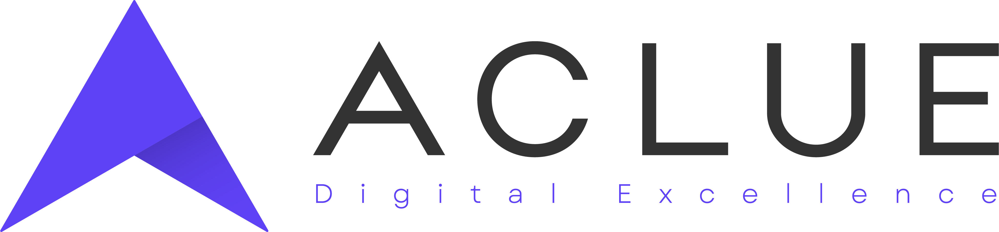

Willkommen in unserer GitHub-Organisation, wir hoffen, dass Du hier etwas Nützliches finden wirst. Fühl dich frei, etwas beizutragen oder mit uns in Kontakt zu treten, wenn Du Fragen hast oder über ein spannendes Thema mit uns sprechen möchtest.

## Über uns

Als Ausgründung eines lange am Markt agierenden Unternehmens verbindet Aclue den Spirit eines Start-Ups mit der Professionalität einer gestandenen Organisation. Jeder unserer Mitarbeiter ist Experte auf seinem Gebiet und trägt mit dieser Superkraft zu dem Erfolg unseres eingespielten Teams bei.

Mit klarem Technologiefokus widmen wir uns in cross-funktionalen Teams den Herausforderungen des Kunden. Als Cloud Natives, Frontend Künstler:innen, DevOps Masters und Machine Learning Pros bringen wir unsere Kompetenzen gewinnbringend ein und setzen die Projekte zielgerichtet um – mit geballten Superkräften. Wir zeichnen uns durch ein starkes Teamgefüge und eine vertrauensvolle Zusammenarbeit aus. Regelmäßiges Grillen und gelegentlich ein Feierabendbierchen kommen bei uns nicht zu kurz.

## Links

## Unsere Superkräfte

## Findest du gut?

[Dann bewirb dich bei uns.](https://www.aclue.de/karriere) Wir freuen uns von dir und deiner Passion zu hören.
